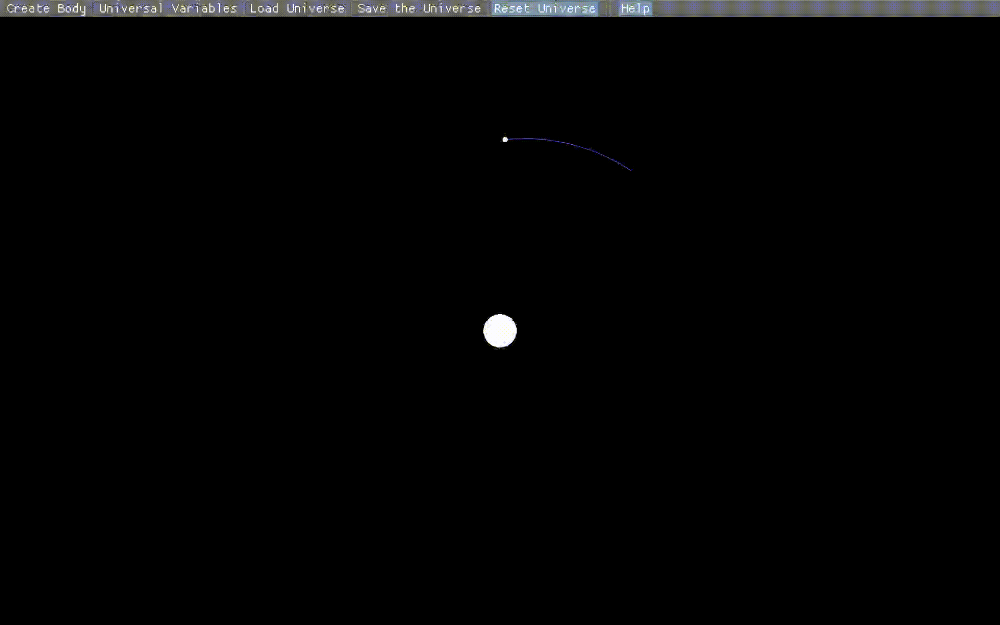
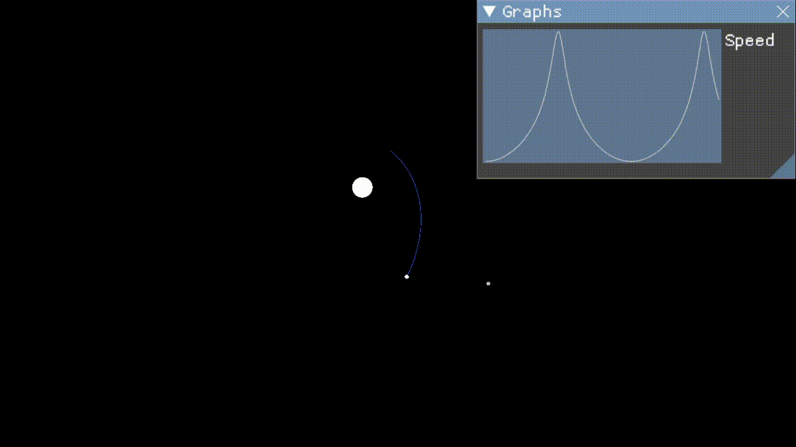
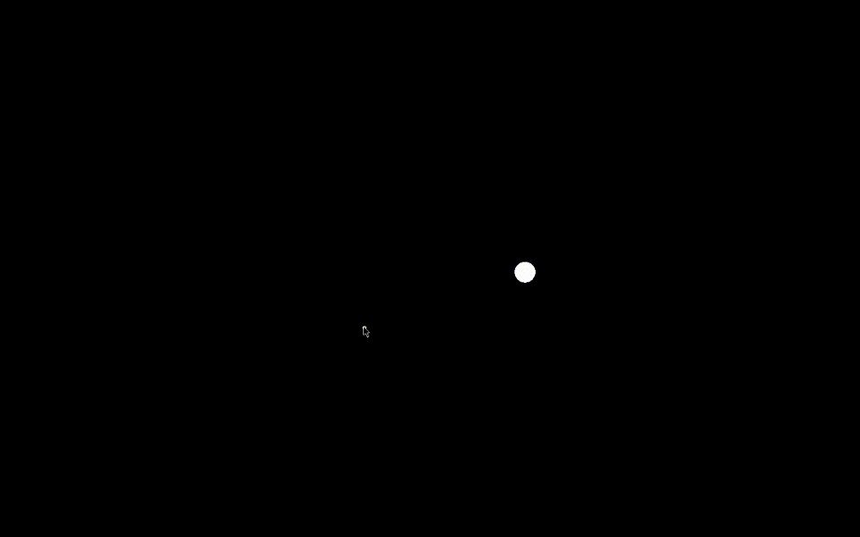
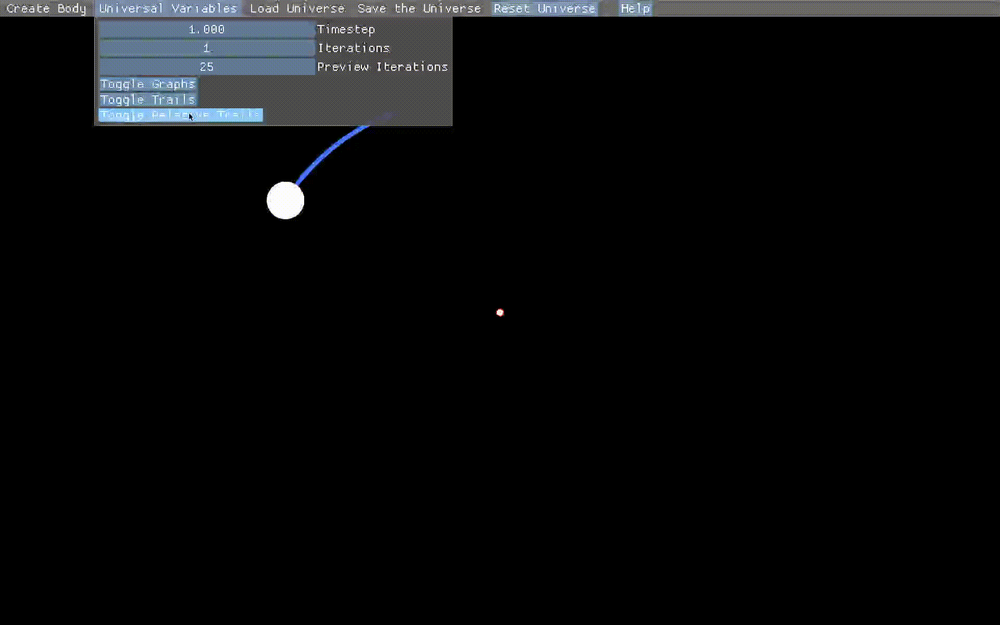
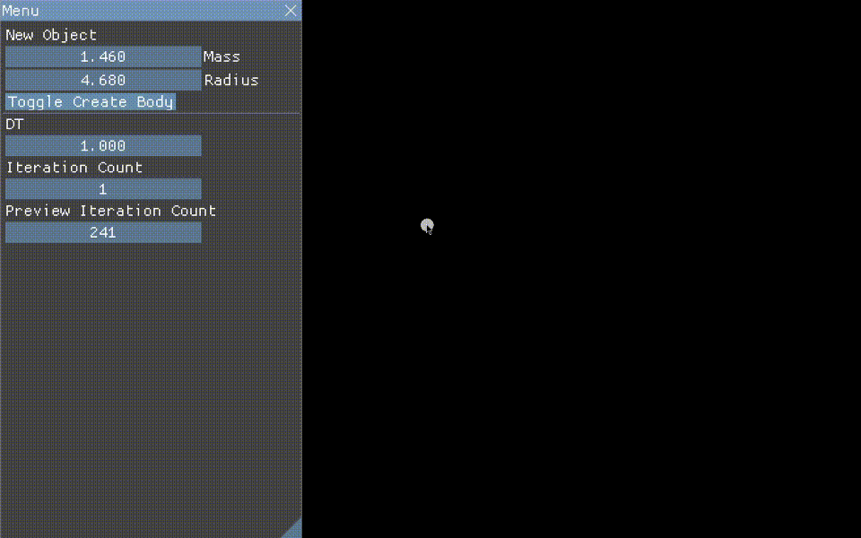
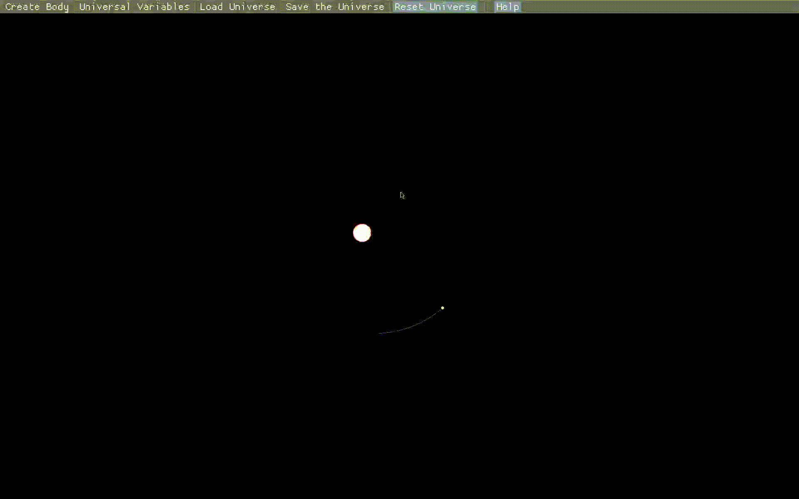

# gravity-sim-v2
Gravity simulator using Newton's Law of Universal Gravitation, made to teach physics

The goal is for this to run on the web and to otherwise be as easily accessible as possible.

Right click a body to edit it and graph its properties. 

The GUI uses `imgui-rs`; using it you can create new bodies, adjust existing bodies, or change variables like the timestep.

Serialization to .ron removed in favor of "serializing" to Lua. You can now write a simple Lua script to add bodies 
and for the basics syntax is practically a markup language.

# compiling/running

### precompiled binaries

There are binaries for Windows and Linux in the releases tab on Github, for MacOS you'd have to compile yourself, but feel free to send me the compiled binary to put on Github.

### compile yourself
Install the rust compiler toolchain via [rustup](https://rustup.rs/)

cd to the folder of this repo and run `cargo run --release`.

# gifs

The start scenario has a simple orbit


You can graph various properties such as speed (more to come)


There are previews/predictions when you create a new body

The orbit changes due to integration error, but the timestep is adjustable


You can make trails relative to the selected object.


Negative mass and negative timestep are cool


You can save and load preset scenarios; binary and nested systems are included.


# Lua documentation

Right now Lua is limited to just creating bodies, I may add more stuff later.

The syntax is fairly self explanatory.

You can control these fields of the body:
- x position (`x` field)
- y position (`y` field)
- x velocity (`x_vel` field)
- y velocity (`y_vel` field)
- radius (`rad` field)
- mass (`mass` field)

To create a single body with x position, y position, x velocity, y velocity, mass, and radius all set to 5:
```lua
add_body({x = 5, y = 5, x_vel = 5, y_vel = 5, mass = 5, rad = 5})
```

Here's the binary star system preset as an example for creating multiple bodies:
```lua
add_bodies(
	{x = 125.000, y = 70.000, x_vel = 0.000, y_vel = 1.000, mass = 80.000, rad = 4.500},
	{x = 175.000, y = 70.000, x_vel = 0.000, y_vel = -1.000, mass = 80.000, rad = 4.500},
	{x = -30.000, y = 70.000, x_vel = 0.000, y_vel = -1.000, mass = 0.500, rad = 1.000},
	{x = 330.000, y = 70.000, x_vel = 0.000, y_vel = 1.000, mass = 0.500, rad = 1.000}
)
```

# details

Made with [`ggez`](https://github.com/ggez/ggez) and [`specs`](https://github.com/amethyst/specs)


Fully inelastic collisions in which the position of the collided body is decided by the mass weighted average position of the two collided bodies. The new radius is decided by adding the volumes.

Uses Verlet integration, with basic Euler integration energy is not conserved so orbits gradually increase in radius whereas with Verlet integration (and I think implicit Euler), all that happens is the orbits slightly shifting.
